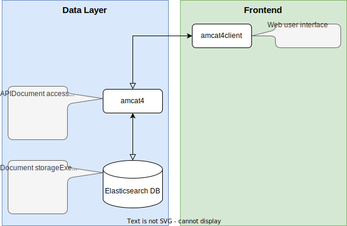

# amcat4docker



To run `Elasticsearch`, `amcat4` and `amcat4client` (the amcat web interface) from docker, download the [docker-compose.yml file](https://raw.githubusercontent.com/JBGruber/amcat4docker/main/docker-compose.yml) or clone the repository to build the images yourself.
For more information about AmCAT, see the [amcat manual](https://amcat-book.netlify.app/).

# Usage
## From dockerhub

Download the prebuild images from our [dockerhub repository](https://hub.docker.com/u/ccsamsterdam) and start the containers:

``` bash
wget https://raw.githubusercontent.com/JBGruber/amcat4docker/main/docker-compose.yml
docker-compose up --pull="missing" -d
```

This pulls the most recent stable images (if it's not already on your machine).
If you want to pull and run the most recent nightly builds of the images instead (which are potentially unstable), use:
<!--  It would be easier to use `docker-compose -f docker-compose-nightlies.yml up --pull="always" -d`, but this does not pull the newest nightlies for some reason -->

``` bash
wget https://raw.githubusercontent.com/JBGruber/amcat4docker/main/docker-compose-nightlies.yml
docker-compose -f docker-compose-nightlies.yml pull && \
  docker-compose -f docker-compose-nightlies.yml up -d
```

## Build Yourself

1. Clone the repository and navigate to folder:

``` bash
git clone https://github.com/JBGruber/amcat4docker.git
cd amcat4docker
```

2. Build without caching to pull the newest version of all packages from GitHub:

``` bash
docker-compose down && \
  docker-compose build --no-cache && \
  docker-compose up -d
```

# Configure

The default setting of amcat is to not require any authentication, so you can immediately access it at <http://localhost>.

Of course, this new instance is still completely empty, so there is little to see. If you want to add some test data, you can use the create-test-data command, which will upload some State of the Union speeches:

``` bash
docker exec -it amcat4 amcat4 create-test-index
```

If you want to change the configuration, for example to require authentication, you can run the interactive configuration
(note that you usually need to restart the amcat4 container to load the new settings):

```bash
docker exec -it amcat4 amcat4 config
docker restart amcat4
```

# Data Location

In the default setup, the storage of AmCAT is contained within the docker container and destroyed when the container is removed.
To set up a folder to permanently store your data in, first create a folder with suitable access rights (the path `~/.elasticsearch/database` is just an example here):

``` bash
mkdir -p ~/.elasticsearch/database && sudo chown -R 1000:1000 ~/.elasticsearch/database
```

Then uncomment the lines last lines in the elastic7 container in your docker-compose.yml file:

```
    volumes: 
      - ~/.elasticsearch/database:/usr/share/elasticsearch/data  # [local path]:[container path]
```

# Upload to dockerhub (for Contributors)

``` bash
docker image push --all-tags ccsamsterdam/amcat4 && \
  docker image push --all-tags ccsamsterdam/amcat4client && 
  docker image push --all-tags ccsamsterdam/ngincat
```
